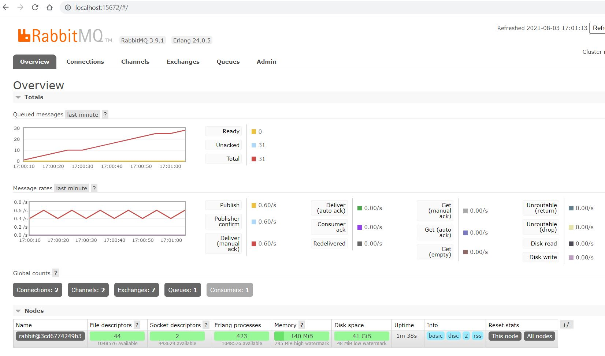
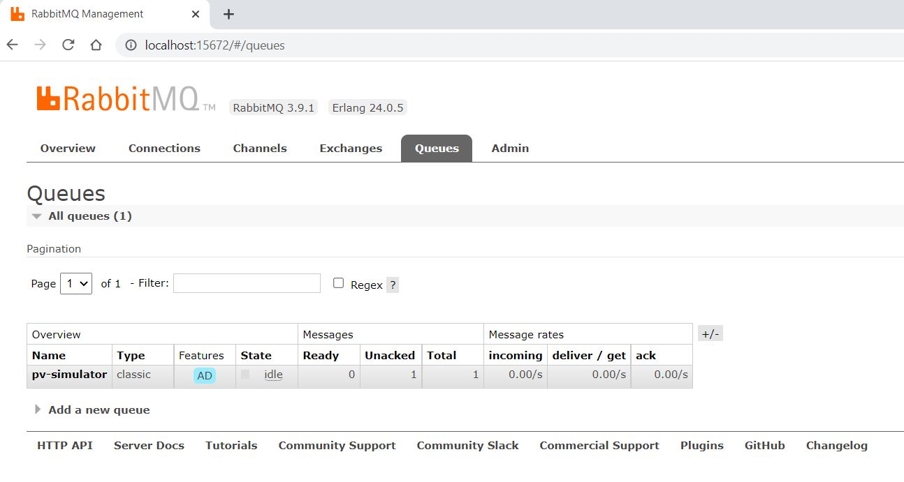

# PV Simulator - RabbitMQ Producer Consumer Example

This project is used to demonstrate usage of RabbitMQ message queue using Python.

### meter-producer: 
This should produce messages to the broker with random but continuous values from
0 to 9000 Watts. This is to mock a regular home power consumption.

### pv-simulator-consumer: 
It must listen to the broker for the meter values, generate a simulated PV
power value and the last step is to add this value to the meter value and output the result.

Writing to a file: We want the result to be saved in a file with at least a timestamp, meter
power value, PV power value and the sum of the powers (meter + PV). The period of a day
with samples every couple of seconds would be enough.

### Libraries used to build the project:
1. Python 3.7 or greater
2. Docker

## Run application

You can use below command to start all services (meter, pv simulator & rabbitmq)

    docker-compose up         # build and starts the container
    docker-compose up -d      # to run in detach mode
    docker-compose stop       # to stop all services

## Result
PV simulator write result data in csv file on this path `pv-simulator-consumer/output/PV_result.csv`

**Make sure you allow docker to share you local system path as pv simulator mounts volume 
with your local system

### Run unit tests
Added sample unittests under pv-simulator-consumer

    cd pv-simulator-consumer            # change directory
    python -m unittest discover tests   # execute tests

## Access RabbitMQ UI

We can access RabbbitMQ dashboard which gives you highlevel overview and some useful management stuff.
Use below command to access it:

    http://localhost:15672/
    

You can check the queue/routing key over here

